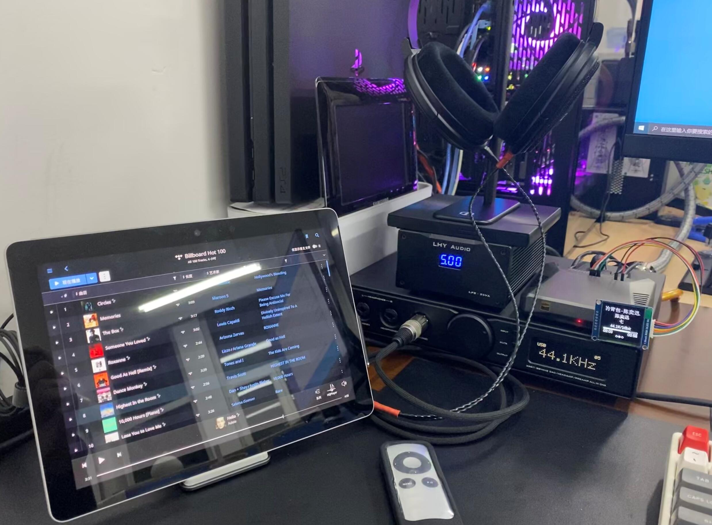
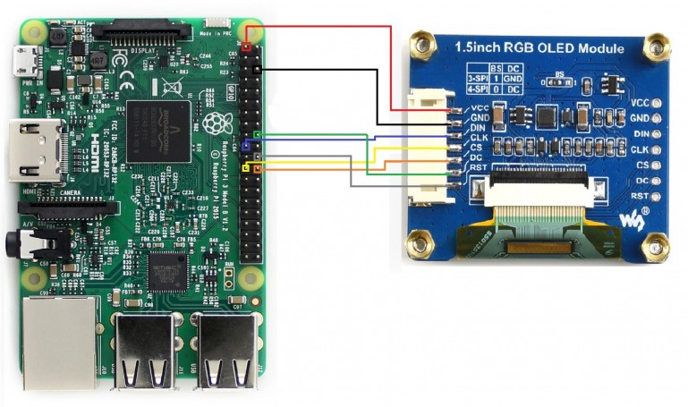
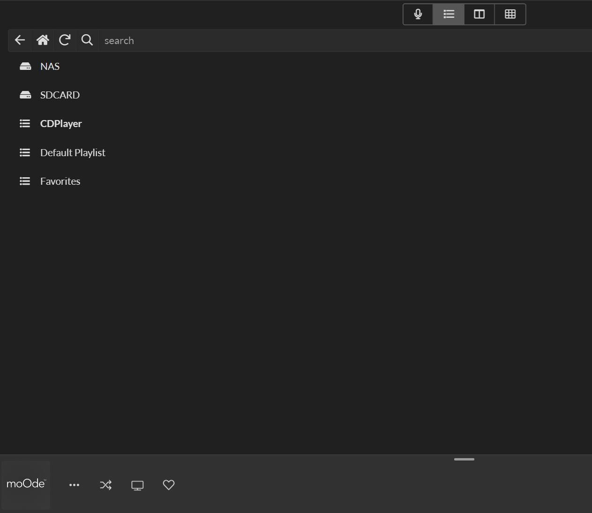

# Moode_Extension
Extensions for Moode, including OLED display, IR control and CD playback.
For now, it is running in a RPi4B with Moode 6.4.0.
With this extension, you can use Apple Remote to control Moode in RPi4B and roon in Windows.

***NOTICE: Use this extension at your own risk, some have not been fully tested!***

# Demo
I use this system under these scenarios.

- NAS -> PRi4B(Moode) -> DAC
- CD Drive -> PRi4B(Moode) -> DAC
- ROON in Windows -> PRi4B(Roon Bridge) -> DAC
- ROON in Windows(Surface Go) -> HQPlayer(PC) -> PRi4B(NAA) -> DAC

The OLED display has 3 screens, including Date Screen, Play Screen, and Renderer Screen.
- Date Screen: Display date and IP.
- Play Screen: Display song info, only activate if Moode is playing.
- Renderer Screen: Only activate if Moode is not playing but DAC is occupied.

The OLED display will go out after 10 seconds to prevent OLED burn-in and any key pressed on the Apple Remote will light it for 10 seconds.



# Hardware
- Raspberry Pi 4B
- [Argon One Case](https://www.argon40.com/catalog/product/view/id/52/s/argon-one-raspberry-pi-4-case) for RPi4B
- [1.5inch RGB OLED Module](http://www.waveshare.net/wiki/1.5inch_RGB_OLED_Module), made by WAVESHARE
- VS1838B Infrared Receiver Module
- [Flirc usb ir receiver](https://flirc.tv/support/flirc-usb)
- Apple Remote A1294
- USB CD Drive

# Wire Connection

## IR receiver Module
The Argon One Case reserved a place for VS1838B, just connect it.
Insert Flirc USB IR receiver into a windows pc.

## OLED Module



|OLED Pin|GPIO Pin|
|-|-|
|VCC|3V3|
|GND|GND|
|DIN|MOSI|
|CLK|SCK|
|CS|CE0|
|DS|24|
|RST|25|

# Installation
## Requirements
- Install [Roon Bridge](http://kb.roonlabs.com/LinuxInstall) and [NAA](https://www.signalyst.eu/bins/naa/images/) (optional).
- Follow the [instructions](http://www.waveshare.net/wiki/1.5inch_RGB_OLED_Module) to ensure that the OLED module works properly.
- Follow the [instructions](https://stackoverflow.com/questions/57437261/setup-ir-remote-control-using-lirc-for-the-raspberry-pi-rpi) to ensure that the IR receiver module works properly. If you use the default position for IR in Argon One, the gpio pin shoule be set as 23.
- Use `sudo apt-get install eject cdparanoia cdde` to install packages required by CD playback.

## OLED Display
```
sudo pip3 install luma.oled
cd /home/pi
git clone https://github.com/TongboZhang/Moode_Extension.git
cd Moode_Extension
sudo chmod 755 src/OLEDDisplay/main.py
sudo cp src/OLEDDisplay/oledd.service /etc/systemd/system/

# Test OLED display
sudo systemctl start oledd
# Wait 10 seconds to start the service
sudo systemctl status oledd

# Make OLED service automatically start on boot
sudo systemctl enable oledd
```

## Tidal Connect
```
apt-get install libflac++6v5*
sudo chmod 755 src/TidalConnect/tidal_connect_application
```

## Remote Control
```
sudo cp src/RemoteControl/apple-silver-A1294-lircd.conf /etc/lirc/lircd.conf.d/
sudo cp src/RemoteControl/irexec.lircrc /etc/lirc

# Test LIRC service
sudo systemctl start lircd
sudo systemctl status lircd

# Test IREXEC service
sudo systemctl start irexec
sudo systemctl status irexec

# Make LIRC and IREXEC service automatically start on boot
sudo systemctl enable lircd
sudo systemctl enable irexec
```

## CD Playback

```
sudo chmod 755 src/CDPlayback/geneCD.sh
sudo cp src/CDPlayback/99-srX_change.rules /etc/udev/rules.d/
```

When you insert a CD, it will generate a playlist named CDPlayer automatically.


# Usage
After installation, you can use Apple Remote to control Moode in RPi4B and roon in Windows.
Here is the key mapping.

|Apple Remote Key|Description|
|-|-|
|UP|Moode: Previous Track|
|DOWN|Moode: Next Track|
|Enter|Moode: Play/Pause|
|LEFT|Roon in windows: Previous Track|
|Right|Roon in windows: Next Track|
|Play|Roon in windows: Play/Pause|
|Menu|None|

# Acknowledgment
Thanks to the following posts.
- [Thread Modes Instruction Guide AUDIOPHONICS RaspDAC Mini Kit - I-Sabre ES9038Q2M](http://moodeaudio.org/forum/showthread.php?tid=664)
- [USB CD-Rom + Moode = UPnP streamer](http://moodeaudio.org/forum/showthread.php?tid=1830)
- [Playing CDs directly from MPD](https://forum.volumio.org/playing-cds-directly-from-mpd-t2411.html)
- [Automated CD ripping, tagging and adding to collection](http://moodeaudio.org/forum/showthread.php?tid=1670)